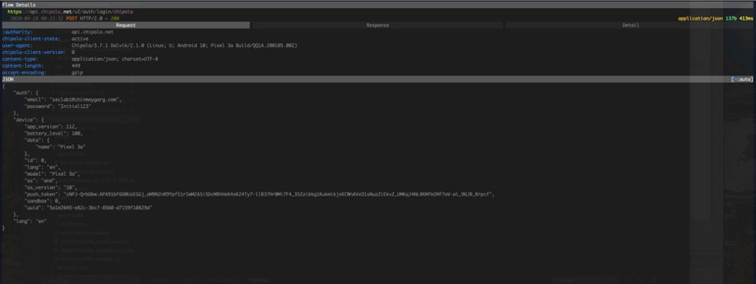
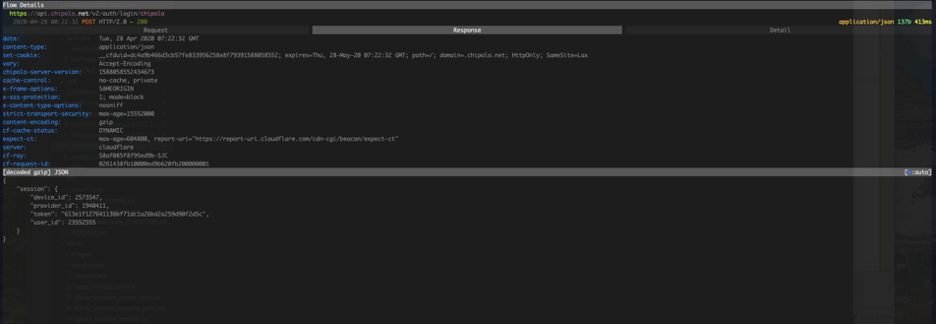
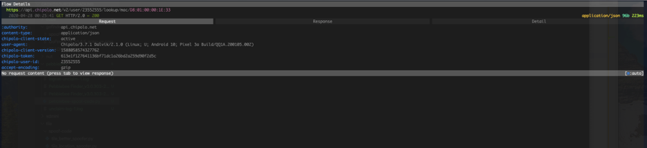
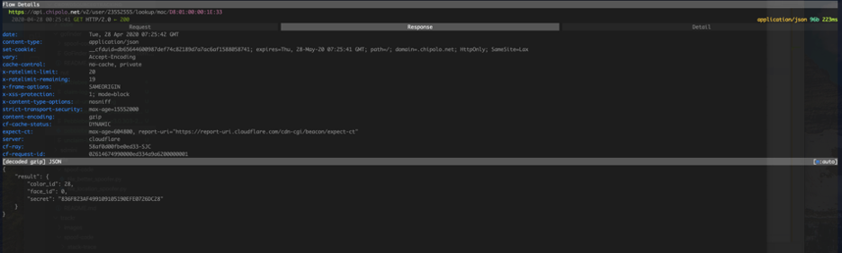
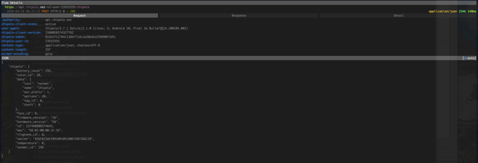
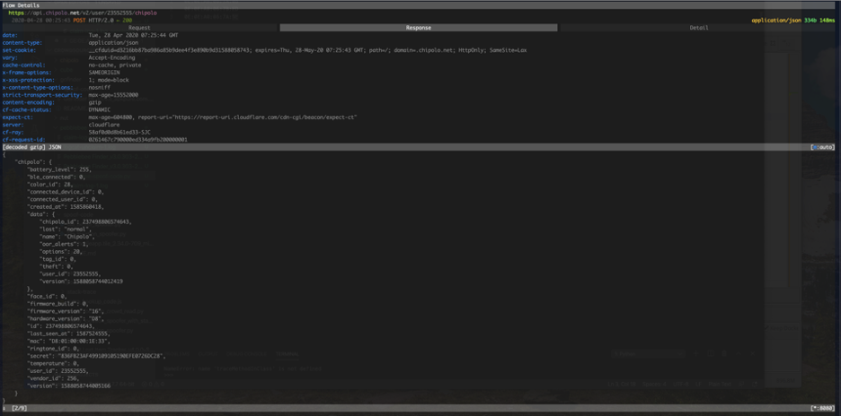
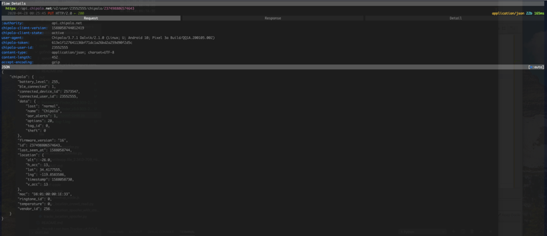
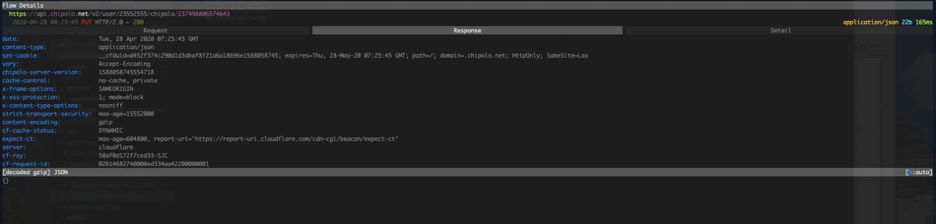
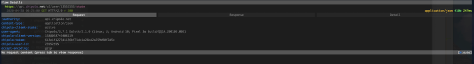
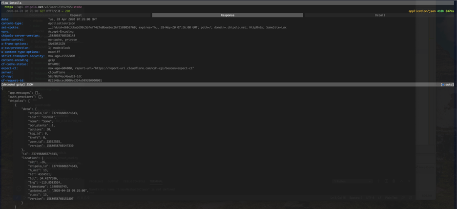

# Chipolo Trackers

## Setup

1. Install ADB and set up root access on owned CD
2. Run `frida-server` as root
3. Install `objection` and create a new re-packaged apk with hooks using `objection patchapk -s base.apk`
4. Install Chipolo Android App (the new one generated from Objection)
5. Passthrough all traffic using `mitmproxy`
6. Perform operations and obtain the `https` requests for various activities

## MAC Addresses

For the devices we used during the experiements, the MAC addresses were:

One -    D8:01:00:00:1E:33
Two - 	 D8:01:00:00:1D:7E
Three - D8:01:00:00:1F:79

## General notes

1. `chipolo.net.v3` is the application to hook frida
2. `j/a/d/b/b` contains HTTP Code
3.  Using secure https headers and cloudflare filtering to avoid sniffing and other attacks
4.  Uses some special header contents for validation. The server checks for this and does not validate cookie without these. All of these headers can be seen within the saved flows or within the screenshots below. 

## Requests Sniffing

### Login
This requests provides the secret needed to authenticate headers moving forward along with userID etc.

#### Request

#### Response

### MAC Lookup
This is done prior to adding any device, to check the secret token in order to be able to add the device. This serves as a type fo authentication for the device. 

#### Request

#### Response

### Register Device
POST Request

#### Request

#### Response

### Device Update
PUT Request

#### Request

#### Response

### State Check

#### Request

#### Response
